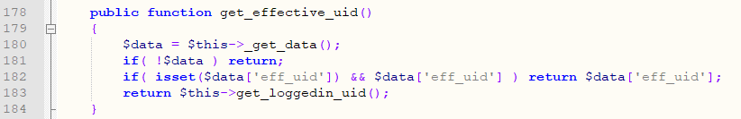
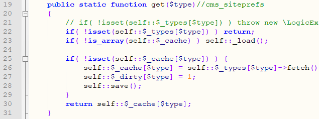
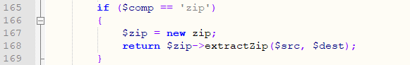
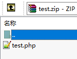
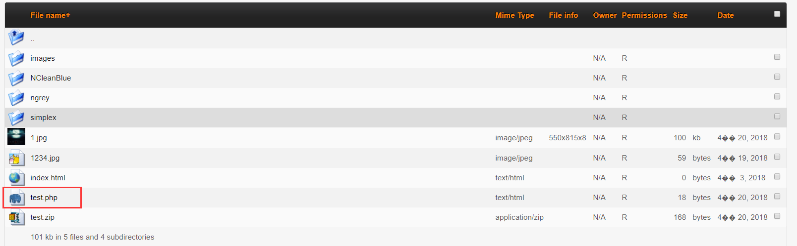

###Cms Made Simple Multiple Vulnerability

####General description：

**[1]CMS Made Simple (CMSMS) 2.2.7 contains the privilege escalation vulnerability from ordinary user to admin user**

**[2]CMS Made Simple (CMSMS) <=2.2.7 "module import" operation in the admin dashboard contains remote code execution vulnerabilities(admin user)**

**[3]CMS Made Simple (CMSMS) <=2.2.7 "file unpack" operation in the admin dashboard contains remote code execution vulnerability(admin user)**

**[4]CMS Made Simple (CMSMS) <=2.2.7 "file view" operation in the admin dashboard contains sensitive information disclose vulnerability(ordinary user)**

**[5]CMS Made Simple (CMSMS) <=2.2.7 "file rename" operation in the admin dashboard contains sensitive information disclose vulnerability that can cause DOS(admin user)**

**[6]CMS Made Simple (CMSMS) <=2.2.7 "module remove" operation in the admin dashboard contains arbitrary file deletion vulnerability that can cause DOS(admin user)**

**[7]CMS Made Simple (CMSMS) <=2.2.7 "file delete" operation in the admin dashboard contains arbitrary file deletion vulnerability that can cause DOS(admin user)**

**[8]CMS Made Simple (CMSMS) <=2.2.7 "file move" operation in the admin dashboard contains arbitrary file movement vulnerability that can cause DOS(admin user)**

**[9]CMS Made Simple (CMSMS) <=2.2.7 contains web Site physical path leakage Vulnerability**

_ _ _

**Environment: **
apache/php 7.0.12/cms made simple 2.2.6 and cms made simple 2.2.7


_ _ _

**[1]The privilege escalation from ordinary user to admin user (2.2.7)**

The previous CVE(http://cve.mitre.org/cgi-bin/cvename.cgi?name=CVE-2018-10084) existed in cmsms version <=2.2.6,and the authentication method was updated in the latest 2.2.7 version.
However, there is still a privilege escalation vulnerability from ordinary user to admin user.

Call the check_login function in line 35 of /admin/index.php


In \lib\page.functions.php, line 88 calls the get_userid function


In \lib\page.functions.php, line 43 calls the get_effective_uid function


In \lib\classes\internal\class.LoginOperations.php, line 183 calls the _get_data function



On line 182, if the data exists and both eff_uid and eff_uid exist in the data, the value of eff_uid is returned (**problem 1**).

**(The following is the function updated in version 2.2.7)**

In the _get_data function of \lib\classes\internal\class.LoginOperations.php


Line 106 gets data from ```$_COOKIE[$this->_loginkey]```

```$this->_loginkey``` comes from ```sha1( CMS_VERSION.$this->_get_salt() );```

The admin dashboard users can get the value in the cookie after logging in, and can also be guessed directly

```CMS_VERSION``` -->2.2.7 (fixed value)

get_salt function is as follows


Line 51 calls \cms_siteprefs::get(\_\_CLASS\_\_) to get the value of ```$salt```

\_\_CLASS\_\_ is a fixed value: CMSMS\LoginOperations

In the \cms_siteprefs::get function of \lib\classes\class.cms_siteprefs.php


Line 86 calls the global_cache::get function, the current \_\_CLASS\_\_ is a fixed value: cms_siteprefs

In the global_cache::get function of \lib\classes\internal\class.global_cache.php



Line 23 calls the _load function
In the _load function


Line 76 calls the get function of \lib\classes\class.cms_filecache_driver.php


Line 146 calls the _get_filename function to get the name of the last cached file

Line 147 reads the value of the cache file through the _read_cache_file function


You can see that the parameters that make up the cache file name are both fixed and guessable (**problem 2**)

And the files in the /tmp/ directory are all directly accessible via the web (**problem 3**)

And the value read from the cache file is also the encrypted value to be used later in the data tamper verification.
So we can get this value by guessing the file name and then reading the cache file directly.

Back to _get_data function


Line 115 gets the value in the cookie and is divided into ```part0::part1```

Line 118 checks the data to prevent data from being tampered with

If the value of ```part0``` is not equal to ```sha1 ($salt.part1)``` cmsms will not continue to execute the code

We already mentioned that this ```$salt``` value can be obtained, so we can bypass this check

The line 119 performs base64decode processing on the ```part1``` value and then processes it with json_decode (<2.2.7 version uses unserialize function, which also leads to the PHP object injection vulnerability).


Line 128 also checks the ``` hash``` in the data. This value is related to the user's password, so we need to have a ordinary user account in the admin dashboard.

To sum up: the key to exploiting the vulnerability is to falsify the ```eff_uid``` value in ```$_COOKIE[$this->_loginkey]``` to 1 (the admin user's id), and then bypass the data's anti-counterfeiting verification.

Exploits: I wrote a vulnerability verification script. simply fill in the relevant parameters and you can let the admin dashboard ordinary users upgrade to the admin user.

python cmsms_2_2_7_poc.py


Using browser to open /admin/index.php will jump to /admin/login.php

Emptying cookies

Then add the cookie generated by the POC
```
8624fce6d211b248d0ec7f93c4797b3ad80e8308
-->4a81ada13ba84ebaa0956bb1b287d333a605d424::eyJ1c2VybmFtZSI6ICJhZG1pbiIsICJlZmZfdWlkIjogMSwgImVmZl91c2VybmFtZSI6IG51bGwsICJ1aWQiOiAyLCAiaGFzaCI6ICIkMnkkMTAkL3d0c2poZ2ZmM25kOG5oWkIxdGVsTzdJZFFKR1o2L0htLnZjQy56aE8xTE01bko1Z1FMOHUifQ==

__c
-->512919d4312874cba5d
```


Then revisit /admin/index.php


Successfully become a admin user!

Vulnerability fix recommendations: Modify the user authentication logic and also restrict the direct access to the tmp directory.

**[2]CMS Made Simple (CMSMS) <=2.2.7 "module import" operation in the admin dashboard contains remote code execution vulnerabilities(admin user)**

In \modules\ModuleManager\action.local_import.php


Line 23 calls the ExpandXMLPackage function of \lib\classes\class.moduleoperations.inc.php

This function will call xml to read the contents of the file


This function reads the value of <file><filename> as the file name
Read the value of <file><data> as the contents of the file
Then generate the file

To sum up: the whole process, CMSMS does not restrict the file type in the process of generating files, resulting in hackers can generate executable .PHP files.

Exploits:
Create a test.xml first


Enter


Click on "Import Module" operation and select test.xml
Visit /modules/test/test.php after submitting


Vulnerability fix recommendations: This may be a function rather than a vulnerability for developers. But from the website security point of view, I still recommend that developers should modify this function: after all the module code is uploaded to the server via FTP(rather than by importing xml and automatically generating a file), the admin can choose to install the module.The consideration for this is that the admin is sure to have permission to upload code via FTP, but the hackers do not, so the security of the website is guaranteed.

**[3]CMS Made Simple (CMSMS) <=2.2.7 "file unpack" operation in the admin dashboard contains remote code execution vulnerability(admin user)**

In the \modules\FileManager\action.fileaction.php file


Enter the decompression process when there is a m1_fileactionunpack parameter or its value is unpack.

Call \modules\FileManager\action.unpack.php


Line 25 gets the name of the file to extract

Line 35 calls the extract function of class EasyArchive

In the extract function of \modules\FileManager\easyarchives\EasyArchive.class.php



Line 165 determines that the file is a zip archive
Line 168 decompresses the file directly

To sum up: you can see that the file in the compressed package is not judged in the whole process, so if the .php file is included in the compressed package, it will be released to the server directory after the decompression, causing the code to execute!

Exploits:
Prepare a test.php file first

Content is ```<?php phpinfo();?>```

Compress it into test.zip



Enter


Upload test.zip file

Select test.zip and select "Unpack" operation


Will generate test.php in the current directory



Access the file, the php file is executed


Vulnerability fix recommendations: when decompressing a file, determine the file type and limit the .php file to be uncompressed to the server.

**[4]CMS Made Simple (CMSMS) <=2.2.7 "file view" operation in the admin dashboard contains sensitive information disclose vulnerability(ordinary user)**

In \modules\FileManager\action.view.php


Line 12 gets the value of file and handles it with the base64decode function

Line 13 gets the absolute address of the file

Line 14 determines that the file exists


Line 30 gets the contents of the file

To sum up: the whole process, after obtaining the file name submitted by the user, CMSMS only carries out the identification of the file existence, does not restrict the directory, and does not judge whether the user is the admin,so any ordinary user in the admin dashboard can read any file content of the website.

Exploits:
Use admin dashboard ordinary user test1 to log in

Then request the following URL (replace the value of __c with your own value, base64decode('Li5cY29uZmlnLnBocA==') is ..\config.php)
```
/admin/moduleinterface.php?mact=FileManager,m1_,view,0&__c=b3d2a517e18bf23a60b&m1_ajax=1&showtemplate=false&m1_file=Li5cY29uZmlnLnBocA==
```

Click "view-source" to see the contents of /config.php


**[5]CMS Made Simple (CMSMS) <=2.2.7 "file rename" operation in the admin dashboard contains sensitive information disclose vulnerability that can cause DOS(admin user)**

In \modules\FileManager\action.fileaction.php


Enter the file rename process when m1_fileactionrename parameter exists or its value is rename.

Call \modules\FileManager\action.rename.php


Line 31 verifies the new file name and cannot contain characters such as .., /, \\, php to prevent .php file generation.

Line 40 gets the file name to be renamed, and ```$oldname``` comes from line 26


```$oldname``` is handled by the decodefilename function, but this function simply performs a base64decode on the characters without any filtering

To sum up: hackers can move /config.php across directories to the /upload/ directory, causing websites to be inaccessible(DOS) and sensitive database information disclose.

Exploits:
Enter


Just select a file, click on the "Rename" operation, and then use burp to grab packets


Modify the value of ```&m1_selall[]``` to ```Li4vY29uZmlnLnBocA==```
Add ```&m1_newname=test```


Then submit the request

/config.php has been moved to the /upload/ directory and renamed test


And the site cannot be accessed(DOS) because it lacks the config.php configuration file


**[6]CMS Made Simple (CMSMS) <=2.2.7 "module remove" operation in the admin dashboard contains arbitrary file deletion vulnerability that can cause DOS(admin user)**

In \modules\ModuleManager\action.local_remove.php


Line 11 get the absolute address of the directory to delete

Line 13 calls recursive_delete function for recursive file deletion


To sum up: hackers can delete /lib/ all files across directories, causing websites to be inaccessible(DOS).

Exploits:
Enter


Just select a module, click on the "Remove" operation, and then use burp to grab packets


Modify ```m1_mod``` to ```..\test``` to delete all files under /test/ (the directories and files are created for testing)


**[7]CMS Made Simple (CMSMS) <=2.2.7 "file delete" operation in the admin dashboard contains arbitrary file deletion vulnerability that can cause DOS(admin user)**

In \modules\FileManager\action.fileaction.php


Enter the file deletion process when there is a m1_fileactiondelete parameter or its value is delete.

Call \modules\FileManager\action.delete.php


Line 17 gets the file name and calls the base64decode function to decode


Line 29 gets the absolute address of the file


Line 30 determines if the file exists

Line 32 determines whether the file is writable

Lines 37-43 determine that it is a directory and the directory is not empty


Line 57 deletes the file

To sum up: the whole process, after getting the file name submitted by the user, CMSMS will use base64decode function to decode it, and then only judge the existence of the file and the file can be written,the hacker can delete arbitrary files and cause dos.

Exploits:
Enter


Just select a file, click on the "Delete" operation, and then use burp to grab packets


Add ```&m1_submit=submit```

Modify ```m1_selall[]``` to ```Li5cbGliXHRlc3QucGhw```

Submit the request, the \lib\test.php(files created for testing) file will be deleted

**[8]CMS Made Simple (CMSMS) <=2.2.7 "file move" operation in the admin dashboard contains arbitrary file movement vulnerability that can cause DOS(admin user)**

In \modules\FileManager\action.fileaction.php


Enter the file move process when there is a m1_fileactionmove parameter or its value is move.

Call \modules\FileManager\action.move.php


Get the file name processed by the base64decode function


Get the destination directory and determine the file write permissions


Judging the source file exists and the source file is readable


Line 85 directly renames the file

To sum up: the whole process, after getting the file name submitted by the user, CMSMS will use base64decode function to decode it, and then only judge the existence of the file and the file readable,hackers can move /config.php to other directories resulting in website DOS.

Exploits:
Enter


Just select a file, click on the "Move" operation, and then use burp to grab packets


Modify ```m1_selall=``` to ```m1_selall[]=Li5cY29uZmlnLnBocA==```

```m1_destdir=/NCleanBlue```

Submit the request, /config.php becomes /upload/config.php

Request /index.php and display it as follows


**[9]CMS Made Simple (CMSMS) <=2.2.7 contains web Site physical path leakage Vulnerability**

the following links can get the absolute path to the site

/modules/DesignManager/action.ajax_get_templates.php


/modules/DesignManager/action.ajax_get_stylesheets.php


/modules/FileManager/dunzip.php


/modules/FileManager/untgz.php


